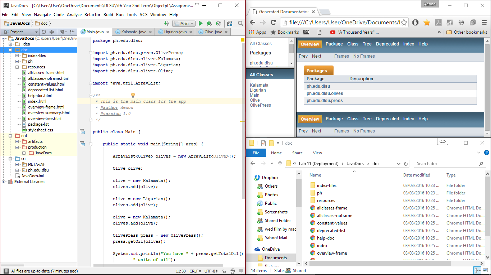

#JavaDocs

Creating the documentation of the Java app

#ScreenShot

#Code

*Code will depend on the project you are trying to add in a documentation file*

#Process

*This applies on IntelliJ IDE*
  1. Add important comments on your source codes
  2. Tools > Generate JavaDoc > Set the output directory > Ok
